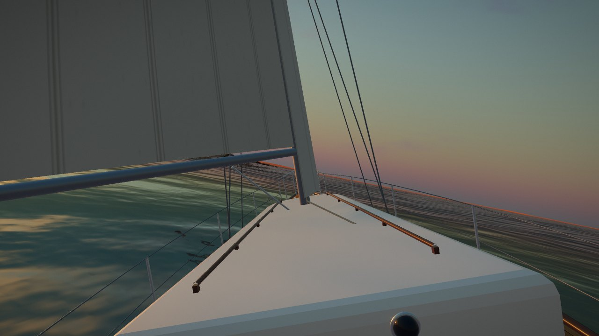

# Skärgård — sail the Finnish archipelago

A relaxing, good-feel sailing game set in the REAL Archipelago Sea at true 1:1
scale: **7,462 actual island outlines** from OpenStreetMap with their real names
(Utö → Jurmo is the real 12.4 km), streamed around the boat as you sail, with a
Google-Maps-style chart to drop in anywhere. You helm a procedurally lofted
**Nautor Swan 36** — heavy-displacement momentum, gusts that lean her over,
tacks that carry way, accidental gybes that slam the boom across, sails that
flog when you pinch — past the real charted seamarks, real village houses and
piers, and Finland's oldest lighthouse on the real Utö. Real-time WebGL, [Three.js](https://threejs.org).



## Run it

```bash
npm install
npm run dev      # → http://localhost:5183
```

**Controls** — `←/→` steer · `↑/↓` trim the sail (throttle under power) · `E` engine ·
`M` **chart** (pan/zoom the whole real Archipelago Sea, click open water to sail there) ·
`C` camera (chase → **helm POV** → orbit) · `T` time of day ·
`I` **data overlay** (shows which features come from real data vs procedural, with rendered-vs-total counts) ·
🔊 button mutes the sound (a real sailing-boat recording, freesound community)

## How it feels

- **The boat is a Swan 36** (S&S 1967), lofted in code from a real station table —
  long overhangs, low trunk, fin keel, masthead sloop, teak deck, boot stripe.
- **Sailing is heavy-displacement real**: no-go zone (*in irons*), fastest on a
  reach, hull-speed wall at ~7.8 kn, ~10 s to wind up from a standstill, carries
  way through a tack, and a hard rudder scrubs a third of your speed. Heel is a
  spring — a gust leans her over a beat later, then she settles.
- **The sea is alive**: Gerstner waves with peaked crests, capillary sparkle in the
  sun path, and a wake that widens and brightens with speed *and* throws a skidding
  wash outboard when you turn hard. The HUD names where you are (real chart names).
- **You are not alone out there**: a Viking Line and a Silja Line ferry work the
  real Turku–Åland fairway across the north of the chart, a yellow road ferry
  shuttles its short crossing, and the yellow Utö-line connection vessel passes
  Nötö and Aspö on her way south — all on water-validated real routes (dashed on
  the chart). The running rigging is simulated rope: sheets sag, sway with the
  heel, and swap working/lazy sides when you tack. The companionway is open —
  there's a lamp lit below.
- **The chart is real**: every island is an actual OSM coastline polygon from the
  outer Archipelago Sea at true 1:1 scale (bbox 59.70–60.20°N, 21.15–22.35°E),
  baked to `public/archipelago_map.json`. Jurmo is the big treeless heath it
  really is; the lighthouse and the real village stand on the real Utö.

## What's real, what's procedural

Press `I` in game to see this live: teal shoreline rings have measured elevation,
orange ones are procedural; green/violet/yellow polygons are the mapped land cover.

**Real data** (all free/open):
- **Live aerial imagery** — the granite wears the *real satellite photo* of that
  exact place, streamed as Web-Mercator tiles per region from Esri World Imagery
  and draped on the terrain by world position (`src/satellite.js`). Press `V` to
  toggle back to the stylised granite. This is the one thing that reaches the
  network at runtime; imagery © Esri, Maxar, Earthstar Geographics.
- **7,462 island outlines** with names — OSM coastline polygons (© OpenStreetMap
  contributors, ODbL), 1:1 scale.
- **Island heights** — Copernicus **EU-DEM (~25 m)** via the AWS Open Data terrain
  tiles, baked per island by [`tools/bake_elevation.py`](tools/bake_elevation.py):
  4,405 islands carry a real measured peak height, the 241 largest a coarse
  interior relief grid (Jurmo's long moraine back, Utö's lighthouse hill). Only
  tiny scalars live in git — no rasters.
- **7,326 building footprints** (position, size, orientation, class), **1,094
  piers**, **760 charted seamarks** with correct IALA types (lateral, all four
  cardinals, lights) — OSM.
- **Satellite-classified land cover** — the same Esri aerial imagery the terrain
  wears is classified per ~12 m pixel into forest / field / bare rock / heath
  ([`tools/bake_landcover.py`](tools/bake_landcover.py), 1,511 islands, calibrated
  so Jurmo comes out moraine heath and Nötö 58% forest). **Trees grow exactly
  where the photo shows canopy**, boulders cluster on its bare rock, fields stay
  open — and with the imagery toggled off, the ground colours follow the same
  classes. OSM's 1,812 wood/heath/scrub polygons remain the fallback for islands
  below the classifier's size threshold.

**Still procedural** (honestly): the height *profile* between shore and peak on
islands without a relief grid, everything below the waterline (bathymetry), the
rock texture, the tree/boulder *models* (their placement now follows the photo),
and the water, waves and weather. The next accuracy step would be the NLS 2 m
laser DEM — deliberately not faked here.

## How it's made

One coherent light drives the whole scene; everything below shares it.

- **The archipelago** is the heart of it: every island is its real OSM outline,
  lifted by a distance-from-shore profile to its real EU-DEM height (or bilinearly
  through its real relief grid), so the islands are the low, glacier-smoothed
  granite whalebacks they actually are. Bare-rock skerries are carpeted in
  **heather heath and low horizontal juniper** (Jurmo) with scattered moraine
  boulders, trees only inside mapped forest — and Finland's oldest lighthouse
  (red-and-white striped tower, green dome, flashing light) stands over the real
  village on the real Utö. You can't sail through islands — the hull grounds on
  the rock and slides along the shore.
- **Granite** is real PBR rock: triplanar-mapped colour/normal/roughness maps
  (Poly Haven, two noise-blended world-space scales so it never tiles) under the
  vertex-coloured ecological tints — wet-waterline → grey/pink rock → orange lichen →
  moss crowns — with a glossy wet band and an animated foam line at the shore.
- **Light is honest**: the sun casts real PCF-soft shadows (trees, rocks, boat,
  lighthouse) from a shadow camera that follows the boat.
- **Sea** keeps Three's planar reflection but is biased toward a saturated Baltic
  teal (softer mirror, brighter body colour) so it reads as water, not a grey mirror.
- **Trees** are instanced pines + birches, sun-rim-lit with a vertex-shader breeze;
  the **wake** is a dynamic foam ribbon laid behind the boat, widening and fading astern.
- **Sky/light** is a Preetham sky feeding a PMREM environment (re-baked on the
  time-of-day switch), with HDR bloom → ACES → a restrained grade.

Most tuning lives in `PRESETS` in [`src/environment.js`](src/environment.js), the
sailing constants in [`src/boat.js`](src/boat.js), and the island generator in
[`src/archipelago.js`](src/archipelago.js).
